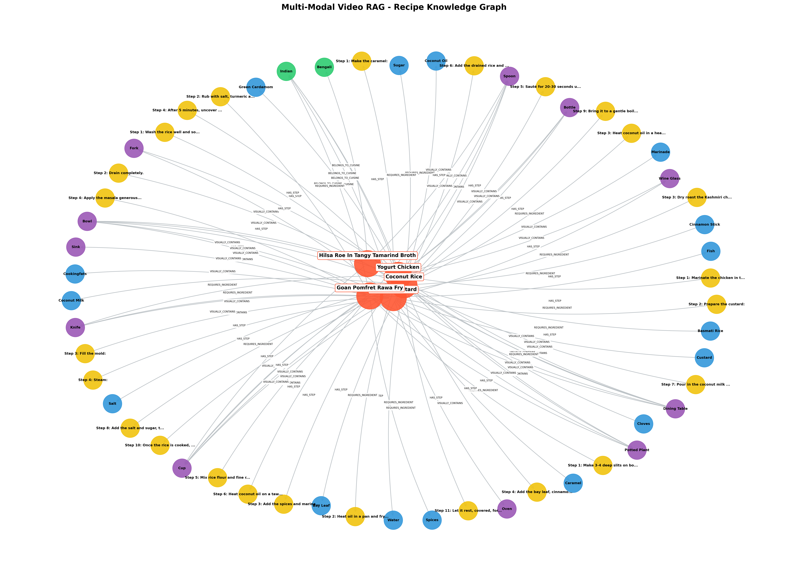

# Multimodal Video Retrieval-Augmented Generation (Video-RAG)

## Nafis L3 Branch

This branch contains Nafis's Layer 3 search engine and demo UI work directly at
the repository root for easy review.

Main L3 files:

```text
06_unified_query_engine.py
app.py
requirements_l3.txt
assets/knowledge_graph.png
```

Organized copy:

```text
nafis_l3/
```

Run the L3 engine:

```bash
python 06_unified_query_engine.py --out output --backend template
```

Run the Streamlit demo:

```bash
streamlit run app.py -- --out output --l3-dir .
```

Knowledge graph preview:



---

This repository contains a Multimodal Video-RAG pipeline for Bengali recipe
videos. The project converts cooking videos into structured multimodal data,
builds retrieval indexes, and exposes a query layer that can answer user
questions using video metadata, transcripts, visual descriptions, lexical
matches, vector search, and knowledge graph context.

The system is organized as a layered pipeline:

```text
Layer 1: Video processing and structured dataset creation
Layer 2: Chunking, embeddings, BM25 index, and vector database
Layer 3: Unified search and reasoning engine
Layer 4: Optional user interface or demo application
```

## Project Goal

The goal is to make short Bengali cooking videos searchable through natural
language. Instead of manually opening each video or JSON file, a user can ask a
query such as:

```text
show me a fish recipe with rawa
which recipe uses coconut milk?
how do I make yogurt chicken?
```

The system retrieves the most relevant recipe video and supporting context from
the processed dataset.

## Repository Structure

```text
Multimodal-Video-Retrieval-Augmented-Generation-Video-RAG-/
├── src/
│   ├── preprocessing/
│   │   ├── 01_video_loader.py
│   │   ├── 02_shot_detector.py
│   │   ├── 03_frame_extractor.py
│   │   ├── 04_ocr_extractor.py
│   │   ├── 05_translator.py
│   │   ├── 06_audio_extractor.py
│   │   ├── 07_audio_transcriber.py
│   │   ├── 08_audio_shot_aligner.py
│   │   ├── 09_object_detector.py
│   │   ├── 10_visual_description.py
│   │   ├── 11_recipe_information_generator.py
│   │   ├── 12_chunk_generator.py
│   │   ├── 13_dense_embedding.py
│   │   ├── 14_bm25_index.py
│   │   └── 15_chroma_db.py
│   └── retrieval/
│       └── 16_hybrid_retriever.py
├── nafis_l3/
│   ├── 06_unified_query_engine.py
│   ├── README.md
│   ├── requirements_l3.txt
│   ├── dataset/
│   │   └── README.md
│   └── output/
│       └── README.md
├── 06_unified_query_engine.py
├── app.py
├── assets/
│   └── knowledge_graph.png
├── requirements_l3.txt
├── Text_RAG_Recipe_Extraction_Pipeline.ipynb
├── requirement.txt
└── README.md
```

## Layer 1: Dataset Creation

Layer 1 processes raw recipe videos and creates a structured dataset. Each video
is converted into a master JSON record containing:

```text
video_info
recipe_information
audio_information
shot_information
frame_information
object_detection
visual_descriptions
```

This gives the project a consistent source of truth for retrieval and
reasoning.

## Layer 2: Indexing and Retrieval Preparation

Layer 2 prepares the processed data for search. It creates text chunks,
embeddings, lexical indexes, and vector database entries.

Main steps:

```text
Chunk Generation
Dense Embedding Generation
BM25 Index Generation
ChromaDB / FAISS Vector Storage
Hybrid Retrieval
```

Dense search is useful for semantic similarity. BM25 is useful for exact
keyword matches such as dish names, ingredients, and cooking terms.

## Layer 3: Unified Query Engine

The Layer 3 contribution is available in:

```text
nafis_l3/06_unified_query_engine.py
```

It is also present at the repository root as:

```text
06_unified_query_engine.py
```

The L3 engine is responsible for taking a user query and returning a structured
answer. It combines three retrieval channels:

```text
1. Vector search using FAISS
2. Lexical keyword search using BM25
3. Knowledge graph lookup using NetworkX
```

The main class is:

```python
VideoRAGEngine
```

The main public method is:

```python
answer(query, top_k)
```

The returned result includes:

```text
query
answer
answer_backend
top_video_id
top_timestamp
top_score
vector_hits
bm25_hits
kg_hits
context_str
```

## L3 Expected Output Folder

The unified query engine expects an output folder with this structure:

```text
output/
├── Metadata/
├── FAISS_Index/
│   ├── video_rag.index
│   └── chunks_metadata.json
└── Knowledge_Graph/
    └── video_rag_kg.graphml
```

If the FAISS index or knowledge graph is unavailable, the engine can still run
with the remaining retrieval channels where possible.

## Answer Backends

The L3 engine supports three answer modes:

```text
template
gemini
qwen
```

`template` is the safest mode for demos because it does not require an API key,
GPU, or model download.

`gemini` uses the Google GenAI API and requires:

```text
GOOGLE_API_KEY
```

`qwen` uses a local Hugging Face model:

```text
Qwen/Qwen2.5-1.5B-Instruct
```

Qwen requires the `transformers`, `torch`, and `accelerate` packages.

## Installation

Install the base project dependencies:

```bash
pip install -r requirement.txt
```

For the L3 module specifically:

```bash
pip install -r nafis_l3/requirements_l3.txt
```

## Running the Existing Retrieval Module

The existing hybrid retriever is located at:

```text
src/retrieval/16_hybrid_retriever.py
```

It uses ChromaDB for dense retrieval and BM25 for sparse retrieval.

## Running the L3 Unified Query Engine

From the repository root:

```bash
python nafis_l3/06_unified_query_engine.py --out output --backend template
```

Alternative backends:

```bash
python nafis_l3/06_unified_query_engine.py --out output --backend gemini
python nafis_l3/06_unified_query_engine.py --out output --backend qwen
```

Recommended demo command:

```bash
python nafis_l3/06_unified_query_engine.py --out output --backend template
```

## Example Query

Example:

```text
rawa
```

Expected relevant result:

```text
Goan Pomfret Rawa Fry
```

This works well with BM25 because the query term appears directly in the recipe
title and metadata context.

## Technologies Used

| Area | Tools |
| --- | --- |
| Language | Python |
| Video Processing | OpenCV, PySceneDetect |
| OCR | EasyOCR |
| Object Detection | Ultralytics YOLO |
| Translation | deep-translator |
| Embeddings | SentenceTransformers |
| Sparse Retrieval | BM25 / rank-bm25 |
| Vector Search | ChromaDB, FAISS |
| Knowledge Graph | NetworkX |
| Answer Generation | Template, Gemini, Qwen2.5 |

## Notes

- Large raw videos, generated indexes, model files, and virtual environments
  should not be committed unless required by the team.
- The `nafis_l3/dataset/` and `nafis_l3/output/` folders are placeholders for
  local testing structure.
- The L3 engine is designed to be independent from the UI, so it can be tested
  from the command line or imported by a Streamlit app.
